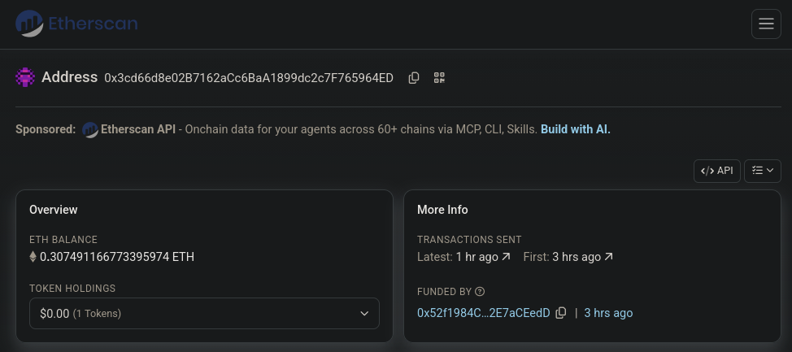
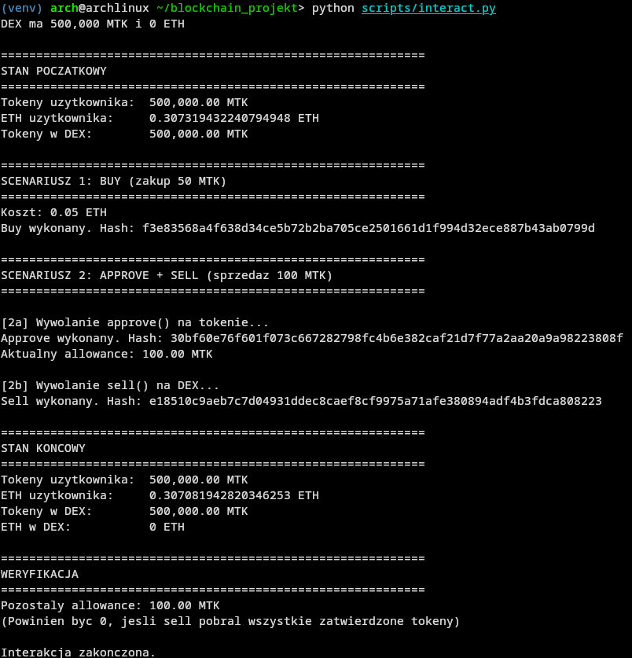
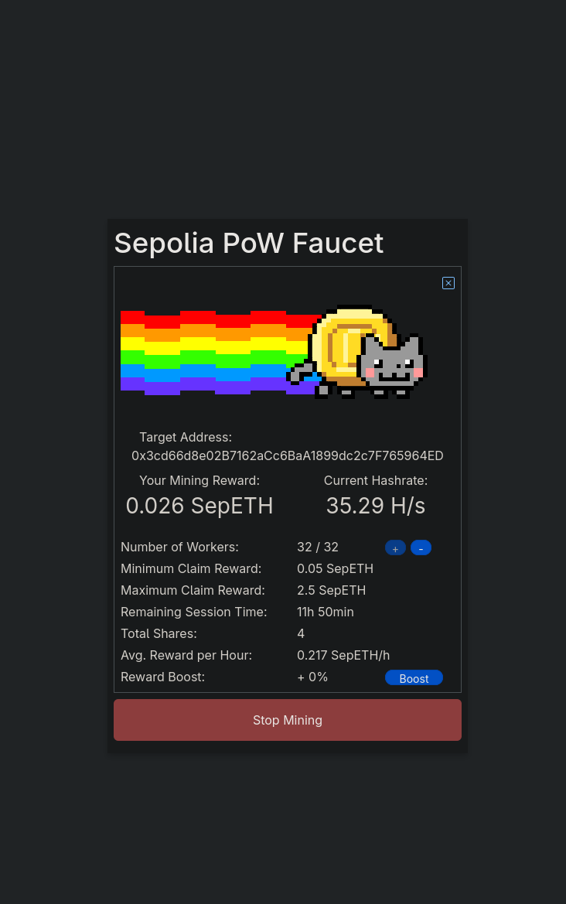

# Token ERC-20 i kontrakt DEX

Projekt zaliczeniowy z przedmiotu blockchain. Implementacja własnego tokena w standardzie ERC-20 oraz kontraktu pośredniczącego (DEX) umożliwiającego wymianę tokenów na ETH. Projekt wdrożony na testnecie Sepolia, obsługa przez skrypty w Pythonie z wykorzystaniem biblioteki web3.py.

## Zawartość projektu

Kontrakty w Solidity:

- **MyToken.sol** – token w standardzie ERC-20. Implementuje `transfer`, `approve`, `transferFrom`, `allowance`, `balanceOf` oraz zdarzenia `Transfer` i `Approval`.
- **DEX.sol** – kontrakt pośredniczący (Decentralized Exchange). Udostępnia funkcje:
  - `buy(uint256)` – zakup tokenów za ETH,
  - `sell(uint256)` – sprzedaż tokenów za ETH,
  - `depositTokens(uint256)` – zasilenie kontraktu w tokeny przez właściciela,
  - `withdrawEth(uint256)` – wypłata ETH przez właściciela.

Skrypty w Pythonie:

- **compile.py** – kompiluje kontrakty i zapisuje artefakty do katalogu `artifacts/`.
- **deploy.py** – wdraża token i DEX oraz przekazuje część tokenów do DEX.
- **transfer_tokens.py** – przekazuje tokeny z portfela użytkownika do DEX (approve + depositTokens).
- **interact.py** – demonstruje pełny cykl buy → approve → sell.
- **balance.py** – wyświetla salda ETH i MTK dla użytkownika i kontraktów.

## Wykorzystane technologie

- Solidity 0.8.20
- Python 3.14
- web3.py
- py-solc-x (kompilacja kontraktów)
- Infura (provider RPC)
- Sepolia (sieć testowa Ethereum)

## Struktura katalogów

```
blockchain_projekt/
├── contracts/
│   ├── MyToken.sol
│   └── DEX.sol
├── scripts/
│   ├── compile.py
│   ├── deploy.py
│   ├── transfer_tokens.py
│   ├── interact.py
│   └── balance.py
├── artifacts/
│   ├── MyToken.json
│   ├── DEX.json
│   └── addresses.json
├── docs/
│   └── screenshots/
│       ├── capture.png
│       ├── dzialanie_programu.png
│       └── ilosceth.png
├── .env
├── .gitignore
├── requirements.txt
└── README.md
```

## Konfiguracja pliku .env

W głównym katalogu projektu należy utworzyć plik `.env` z następującymi zmiennymi:

```
INFURA_KEY=klucz_api_infura
MY_ADDRESS=0xadres_portfela
PRIVATE_KEY=0xklucz_prywatny
```

Poszczególne wartości:

- **INFURA_KEY** – klucz API uzyskany po rejestracji na infura.io. W panelu Infura należy utworzyć nowy klucz i wybrać sieć Sepolia.
- **MY_ADDRESS** i **PRIVATE_KEY** – dane konta z portfela MetaMask. Adres publiczny można odczytać z interfejsu, klucz prywatny eksportuje się w ustawieniach konta.
- **Sepolia ETH** – wymagane do opłacenia gazu. Ze względu na wymóg minimalnego salda mainnet w części faucetów, wykorzystano pk910 Proof-of-Work Faucet, który nie stawia takiego warunku.

Plik `.env` nie powinien być publikowany w repozytorium.

## Instalacja

```bash
python -m venv venv
source venv/bin/activate
pip install -r requirements.txt
```

W przypadku braku `requirements.txt`:

```bash
pip install web3 py-solc-x python-dotenv
```

## Instrukcja uruchomienia

### 1. Kompilacja kontraktów

```bash
python scripts/compile.py
```

Skrypt instaluje kompilator `solc 0.8.20` (jeśli nie jest dostępny), kompiluje `MyToken.sol` i `DEX.sol`, a wyniki zapisuje w katalogu `artifacts/`.

### 2. Wdrożenie kontraktów

```bash
python scripts/deploy.py
```

Skrypt wykonuje kolejno:

1. Wdrożenie tokenu `MyToken` z początkową pulą 1 000 000 MTK.
2. Wdrożenie kontraktu `DEX` z adresem tokenu jako argumentem konstruktora.
3. Wywołanie `approve` na tokenie oraz `depositTokens` na DEX w celu przekazania 500 000 MTK do kontraktu.

Adresy wdrożonych kontraktów zapisywane są w `artifacts/addresses.json`. Uruchomienie skryptu powoduje wdrożenie nowych instancji kontraktów i nadpisanie poprzednich adresów.

### 3. Weryfikacja sald

```bash
python scripts/balance.py
```

Skrypt wyświetla saldo ETH użytkownika oraz salda ETH i MTK dla tokenu i DEX. Zaleca się uruchomienie przed testami w celu sprawdzenia, czy konto posiada wystarczającą ilość ETH na opłacenie gazu.

### 4. Demonstracja działania

```bash
python scripts/interact.py
```

Skrypt wykonuje następujące operacje:

1. **BUY** – zakup 50 MTK za 0.05 ETH (DEX otrzymuje ETH).
2. **APPROVE** – zatwierdzenie DEX do pobrania 100 MTK z konta użytkownika.
3. **SELL** – sprzedaż 100 MTK, wypłata 0.1 ETH z DEX.

Kolejność operacji wynika z faktu, że kontrakt DEX nie posiada na starcie żadnych środków ETH. Funkcja `sell` wymaga, aby kontrakt miał wystarczający zapas ETH na wypłatę, dlatego operacja `buy` musi zostać wykonana jako pierwsza.

## Adresy wdrożonych kontraktów

- MyToken: `0x68fd26694733231A048b5546597b537fdbD6C3c7`
- DEX: `0xE7FeE0d56F1133e4af59ccF6df4DB669A8E5C3f7`

Kontrakty są dostępne w eksploratorze bloków pod adresem https://sepolia.etherscan.io.

## Dokumentacja zrzutów ekranu

Katalog `docs/screenshots/` zawiera zrzuty ekranu dokumentujące działanie projektu.

### Saldo ETH po pobraniu z faucetu

Zrzut przedstawia saldo konta po pobraniu Sepolia ETH z faucetu Proof-of-Work. Środki te były wymagane do opłacenia gazu przy wdrożeniu kontraktów i wykonaniu transakcji testowych.



### Wynik działania skryptu interact.py

Zrzut przedstawia pełny cykl operacji wykonany przez skrypt `interact.py`: zakup tokenów (BUY), zatwierdzenie kontraktu DEX (APPROVE) oraz sprzedaż tokenów (SELL). Widoczne są salda początkowe i końcowe użytkownika oraz kontraktu DEX.



## Opis działania

### Token ERC-20

Token `MyToken` implementuje standard ERC-20. Każdy adres posiada własne saldo (`balanceOf`), a transfery między kontami odbywają się przez funkcję `transfer`. Łączna podaż tokenów (`totalSupply`) jest ustalana w konstruktorze i przypisywana do adresu wdrażającego.

### Kontrakt DEX

Kontrakt `DEX` pełni rolę prostego kantoru wymiany. Posiada własny zapas tokenów MTK oraz ETH, a kurs wymiany jest stały: 1 MTK = 0.001 ETH (wartość `TOKEN_PRICE`).

Mechanizm zakupu (`buy`): użytkownik wysyła do kontraktu ETH o wartości równej `amount * TOKEN_PRICE`. Kontrakt weryfikuje poprawność kwoty oraz dostępność tokenów, a następnie wykonuje `transfer` tokenów na adres użytkownika.

Mechanizm sprzedaży (`sell`): użytkownik musi uprzednio wywołać `approve` na kontrakcie tokenu, udzielając DEX-owi uprawnienia do pobrania określonej liczby tokenów. Następnie DEX wywołuje `transferFrom`, pobiera tokeny na własne konto i wypłaca użytkownikowi równowartość w ETH.

Mechanizm `approve` + `transferFrom` jest standardem w ERC-20 i wynika z faktu, że kontrakt nie może samodzielnie zainicjować transferu z cudzego konta bez wyraźnego upoważnienia.

## Napotkane problemy i rozwiązania

- **KeyError przy kompilacji** – kompilator Solidity zwraca kontrakty w słowniku kluczowanym nazwą pliku, a nie nazwą kontraktu. Rozwiązanie: ujednolicenie nazwy pliku i kontraktu (`MyToken.sol` → `contract MyToken`).

- **InvalidAddress w web3.py** – biblioteka wymaga adresów w formacie checksum (EIP-55). Rozwiązanie: konwersja przez `Web3.to_checksum_address()`.

- **nonce too low** – przy wysyłaniu wielu transakcji pod rząd, domyślne `get_transaction_count` zwraca jedynie transakcje potwierdzone. Rozwiązanie: użycie `get_transaction_count(address, "pending")`.

- **Timeout przy oczekiwaniu na receipt** – Infura na darmowym planie może odpowiadać z opóźnieniem powyżej 120 sekund. Rozwiązanie: zwiększenie parametru `timeout` w `wait_for_transaction_receipt` do 300 sekund.

- **insufficient funds** – brak weryfikacji salda przed wysłaniem transakcji zakupu. Rozwiązanie: skrypt `balance.py` do sprawdzania salda przed testami.

- **DEX nie ma wystarczajaco ETH** przy wywołaniu `sell` – kontrakt startuje z zerowym saldem ETH. Rozwiązanie: zmiana kolejności operacji w `interact.py` (BUY przed SELL).

- **Transakcja wdrożenia DEX nie została potwierdzona w czasie** – `deploy.py` przerwał działanie na timeoucie, jednak transakcja została włączona do bloku. Rozwiązanie: ręczne odczytanie adresu z Etherscan i wpisanie do `addresses.json`.

## Ograniczenia projektu

- Brak testów jednostkowych.
- Stały kurs wymiany – brak mechanizmu automatycznego dostosowania ceny na podstawie podaży i popytu (jak `x*y=k` w Uniswap).
- Brak implementacji `increaseAllowance` i `decreaseAllowance` (funkcje opcjonalne w standardzie ERC-20).
- Brak zabezpieczeń przed front-runningiem.

## Podsumowanie

Projekt realizuje wymagania na ocenę 4.0:

- Implementacja tokena w standardzie ERC-20.
- Implementacja kontraktu pośredniczącego z funkcjami `buy`, `sell` i obsługą `approve`/`transferFrom`.
- Wdrożenie kontraktów na testnecie Sepolia z wykorzystaniem Infura jako providera RPC.
- Aplikacja kliencka w Pythonie z wykorzystaniem web3.py.

Do uruchomienia projektu wymagane są: klucz API Infura, konto Ethereum z kluczem prywatnym oraz niewielka ilość Sepolia ETH na opłacenie gazu.

## P.S

Czego to się nie robi dla projektu

